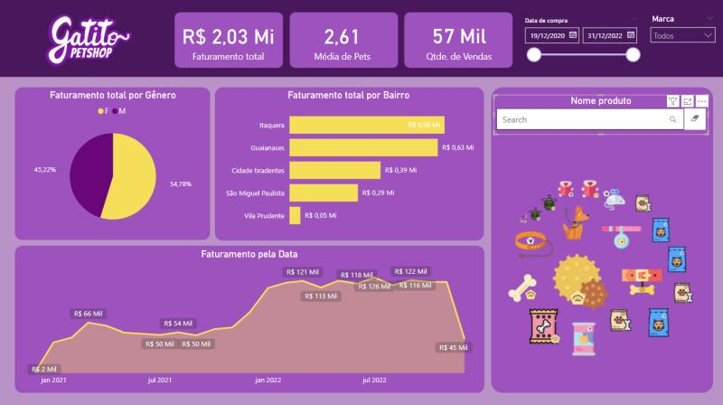

#  Gatito Petshop - Dashboard de Vendas e Clientes

##  Descrição
Projeto de dashboard interativo desenvolvido no **Power BI** para a empresa fictícia *Gatito Petshop*.  
A solução permite acompanhar métricas de vendas, perfil de clientes, análise de produtos e segmentação por marca.  
Além disso, o painel auxilia na **tomada de decisões estratégicas**, como a abertura de novas lojas.

##  Objetivo
Fornecer uma ferramenta visual e intuitiva para:  
- Monitorar vendas em tempo real  
- Identificar o perfil de clientes  
- Comparar desempenho de produtos e marcas  
- Apoiar decisões de expansão de lojas  

##  Tecnologias utilizadas
- **Power BI Desktop**  
- **DAX** para criação de medidas personalizadas  
- **Modelagem de dados** para integração e relacionamento das tabelas  

##  Principais análises
- **Métricas de vendas** → faturamento total, ticket médio, evolução  
- **Perfil de clientes** → segmentação e comportamento de compra  
- **Produtos e marcas** → itens mais vendidos e comparativo de performance  
- **Expansão estratégica** → insights para abertura de novas unidades  

##  Exemplo do dashboard

##  Estrutura do projeto
- `data/` → bases de dados utilizadas  
- `reports/` → arquivo `.pbix` do Power BI  
- `images/` → captura do dashboard  
- `README.md` → documentação do projeto  

---
 Projeto desenvolvido como parte do meu portfólio em **análise de dados e BI**.
